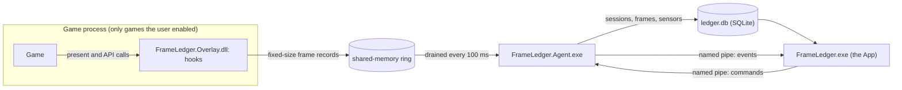

# Architecture

The full document is [`docs/01_ARCHITECTURE.md`](../docs/01_ARCHITECTURE.md); the IPC details are in
[`docs/07_IPC.md`](../docs/07_IPC.md).

## The processes

| What | Runs | Does |
|---|---|---|
| `FrameLedger.exe` — `src/FrameLedger.App` | as the user | The WPF app: library, sessions, charts, settings. Reads SQLite; talks to the agent over the pipe. |
| `FrameLedger.Agent.exe` — `src/FrameLedger.Agent` | as the user; as administrator only if the user opts in | Watches for tracked games, runs the anti-cheat guard, injects, drains the ring, reads sensors once a second, writes SQLite. Closing the App never stops it. |
| `FrameLedger.Overlay.dll` — `src/native/FrameLedger.Overlay` | inside the game | Hooks presentation (DXGI for Direct3D 11 and 12, and OpenGL) and the upscaler, frame-generation and ray-tracing calls, and writes one record per frame into the ring. A hook never blocks, allocates, logs or throws. It draws nothing on screen. |
| `FrameLedger.VkLayer.dll` — `src/native/FrameLedger.VkLayer` | inside a Vulkan game | An implicit Vulkan layer instead of hooks, active only in a game FrameLedger starts. |
| `FrameLedger.Guard.dll`, `FrameLedger.NvapiBridge.dll`, `FrameLedger.ProcessStats.dll` | inside the agent, never a game | The anti-cheat guard (required), NVIDIA's extra sensors (optional), and the game's own memory read from outside it (optional). An optional one missing makes its fields N/A. |

`src/FrameLedger.CaptureHost` is a developer tool and is never shipped.

## Two tiers

- **Tier 1 — measured.** The user switched hooking on for the game, and the guard found nothing: every frame is
  recorded.
- **Tier 2 — recorded only.** No hooking: the session keeps its duration, the PC's sensors, the game's memory, its
  display mode, and *why* it was not measured. Every frame figure is N/A, never an estimate.

There is no third rung: without the hook there is no frame measurement at all.

## How a frame gets to the screen

1. The agent's watcher sees a tracked game's executable start (by full path, once a second).
2. Hooking off, or not consented: the session is Tier 2.
3. The guard checks the game's process tree, the PC's drivers and services, its title lists and the game's install
   folder. Any finding, or any doubt, refuses: Tier 2, with the reason.
4. On a pass, the guard injects the Overlay with the documented `LoadLibraryW`, under its real name.
5. The Overlay installs its hooks, creates the ring and publishes a handshake; the agent checks the layout version and
   the build id before it reads anything.
6. The agent drains the ring every 100 ms and checks the game again every 30 seconds; a finding unhooks.
7. When the game exits, the agent finalizes the session and writes it to SQLite in one transaction; the App reads it.

## Where data lives

`%LOCALAPPDATA%\FrameLedger`: `ledger.db` (WAL mode), `logs\`, `crashdumps\`, and `tmp\` for a session in progress
(its `.partial` file). The App installs separately, in `%LOCALAPPDATA%\FrameLedger.App`.
